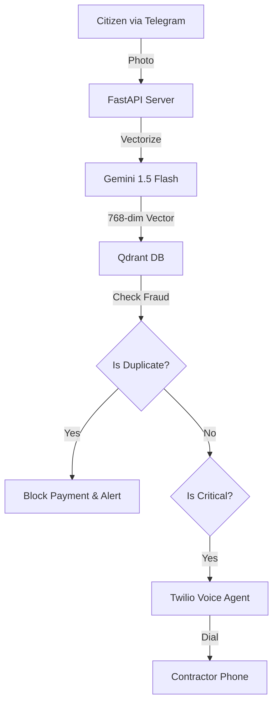

# CivicLens: Autonomous Governance Defense System

> **"Palantir for Potholes"** — An AI-powered civic audit system that detects infrastructure fraud using Vector Search and enforces accountability via Autonomous Voice Agents.

CivicLens acts as an **unbribable digital bureaucrat** — analyzing evidence, detecting fraud, and autonomously escalating action.

---

## The Problem

Governments lose **billions annually** to *Ghost Repairs* — contractors claiming payments for work that was never completed.  
Manual inspection and auditing **does not scale**.

---

## The Solution

CivicLens is an **AI-powered Governance Defense Core**:

| Module | Function |
|------|---------|
| Ingest | Citizens submit photos via Telegram / WhatsApp |
| Analyze | Gemini 1.5 evaluates damage severity & material quality |
| Audit | Qdrant Vector Search detects duplicate or recycled evidence |
| Enforce | Twilio IVR autonomously calls contractors for escalation |

---

## System Architecture


---

## Tech Stack
1. **Backend**: FastAPI
2. **AI Vision**: Google Gemini 1.5 Flash
3. **Vector DB**: Qdrant
4. **Voice Agent**: Twilio Programmable Voice (IVR)
5. **Messaging**: Telegram Bot API
6. **Tunneling**: Ngrok
7. **Language**: Python 3.9+

---
## Setup Instructions (End-to-End)
~ Prerequisites  
    1.**Python 3.9+** 
    2.**Ngrok (for Twilio → local tunnel)**
    3.**Twilio Account (SID, Token, Number)**
    4.**Google Gemini API Key**
    5.**Telegram Bot Token (@BotFather)**

---
## Installation
```
git clone https://github.com/YOUR_USERNAME/CivicLens.git
cd CivicLens
pip install -r requirements.txt
```
---
## Configuration
Create a ```.env ``` file in the root directory:
```
# AI Core
GOOGLE_API_KEY=your_gemini_api_key_here

# Voice Enforcer (Twilio)
TWILIO_ACCOUNT_SID=your_twilio_sid
TWILIO_AUTH_TOKEN=your_twilio_auth_token
TWILIO_FROM_NUMBER=+1234567890
TARGET_PHONE_NUMBER=+919876543210

# Telegram Bot
TELEGRAM_BOT_TOKEN=your_telegram_bot_token

# Network Tunnel (Updated via Ngrok)
NGROK_URL=https://your-url.ngrok-free.app
```
> Do not add trailing ``` /``` in NGROK_URL
---
## Running the Demo
Step 1: Start Ngrok
```
ngrok http 8000
```
Copy the forwarding URL:
```
https://abcd1234.ngrok-free.app
```
Update it inside ```.env``` :
```
NGROK_URL=https://abcd1234.ngrok-free.app
```
---
Step 2: Start FastAPI Backend
```
uvicorn server:app --reload --port 8000
```
Handles:

1.Twilio IVR callbacks

2.Telegram processing endpoints
---
Step 3: Start Defense Core CLI
```
python main.py
```
This starts the live monitoring engine.

---
## Demo Flow

1.CLI shows:
> Waiting for Telegram Image...

2.User sends pothole photo to Telegram bot

3.System pipeline executes:
    Gemini evaluates severity
    Qdrant checks duplicate fraud
    If critical → triggers Twilio call
    
4.You receive a phone call:
```
Press 1 for English, 2 for Hindi
```
5.IVR responds in real time.

---


## Use Cases

* Smart Cities automated audits
* Anti-corruption public infrastructure monitoring
* Civic accountability systems
* Government contractor verification
* ESG compliance automation

---

## License

**MIT License**

>Built for
Convolve 4.0 | Qdrant – MAS Track – Round 2 (2026)


---

## Author
--- *Nihal Yadav*
